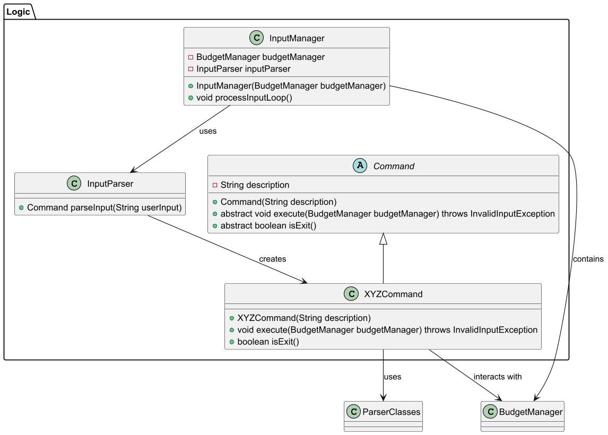
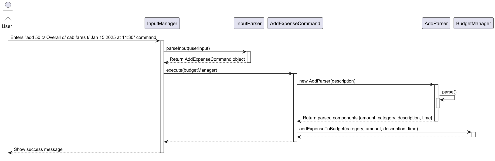
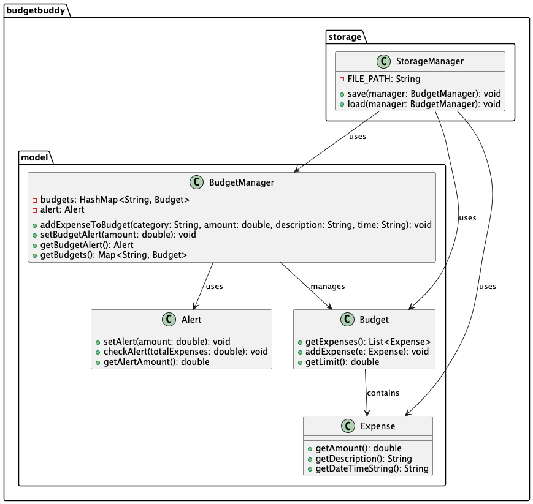
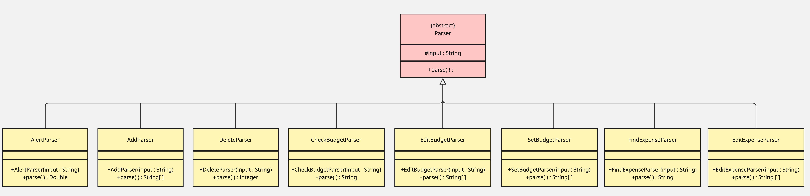

# Developer Guide

## Table of Contents

- [Acknowledgements](#acknowledgements)
- [Design and implementation](#design-and-implementation)
- [Product scope](#product-scope)
    - [Target user profile](#target-user-profile)
    - [Value proposition](#value-proposition)
- [User stories](#user-stories)
- [Non-functional requirements](#non-functional-requirements)
- [Glossary](#glossary)
- [Manual testing](#instructions-for-manual-testing) 

## Acknowledgements

Budget Buddy uses the following tools for development:
1. JUnit5 - For unit testing and ensuring code reliability.
2. Gradle - For efficient build automation and dependency management. 

## Design
### Input Processing Component
Here is a partial class diagram of the `Input Processing` component:

The sequence diagram below illustrates the interactions within the `Input Processing` component, taking the user input:
`"add 50 c/ Overall d/ cab fares t/ Jan 15 2025 at 11:30"` as an example.

How the `Input Processing` component works:
1. When a user input is taken in, it is passed into the `processInputLoop()` function of an `InputManager` object.
2. The user input is then passed into an `InputParser` object that creates and returns a command object that matches the 
input command (e.g., `AddExpenseCommand`). 
3. The command object is then executed by the `InputManager`.
4. The `execute` function then creates a parser object (e.g., `AddParser`) that is called to parse the input and return
the result in a `String` array.
5. The command class then calls the corresponding methods in `BudgetManager` to carry out the task (e.g., Adding an 
expense).

{Describe the design and implementation of the product. Use UML diagrams and short code snippets where applicable.}
## Implementation
### Implementation of Storage Feature
The `StorageManager` class is responsible for reading from and writing to a local text file.
It loads all budgets and alerts when the application starts and saves them on every update.

The diagram below illustrates how `StorageManager` interacts with `BudgetManager`, `Budget`, `Expense`, and `Alert`.

### Parser Class
#### Overview
The Parser<T> abstract class serves as the base for various command-specific parsers in BudgetBuddy. 
Each parser extends Parser<T> and implements the parse() method to extract command-specific details.

#### Class Diagram

#### Example Implementation
The `AddParser` class is responsible for extracting details from the add command. It parses the input string and extracts four main components:
* Amount 
* Category 
* Description 
* Date/Time

#### Code Flow
* The constructor initializes the input. 
* The parse() method validates and extracts details using string splitting operations. 
* If required tokens (c/, d/, t/) are missing, an InvalidInputException is thrown. 
* The extracted details are returned as a String[] array.

## Product scope
### Target user profile

Budget Buddy is built for students who want a simple way to manage their finances.
Many students have a limited income, busy schedules, and need an easy tool to:

1. Track daily expenses
2. Set budgets
3. Stay financially aware

Budget Buddy helps with common challenges like overspending, forgetfulness, and balancing expenses across different categories.

### Value proposition

Budget Buddy helps students take control of their finances with a simple, intuitive tool for tracking expenses, setting budgets, and gaining financial insights.

Many students struggle with money management, leading to overspending and financial stress. Budget Buddy addresses this by providing:

- Real-time updates to keep spending in check
- Spending alerts to prevent overspending
- Budget summaries for a clear financial overview

**Budget Buddy helps students:**
- Build better financial habits
- Stick to their budget
- Track spending with ease
- Make smarter money choices
- Set financial goals
- Gain confidence managing money

## User Stories

|Version| As a ...                                                 | I want to ...                                         | So that I can ...                                                               |
|--------|----------------------------------------------------------|-------------------------------------------------------|---------------------------------------------------------------------------------|
|v1.0| financially conscious student                            | log my daily expenses                                 | track my spending habits effectively.                                           |
|v1.0| busy student                                             | categorise my expenses                                | see where most of my money is spent.                                            |
|v1.0| student on limited budget                                | set a overall budget                                  | I can manage my finances and avoid overspending.                                |
|v1.0| forgetful student with hectic schedule                   | see the portion of my budget I have used              | be more financially aware.                                                      |
|v1.0| time-strapped student managing multiple responsibilities | view a summary of my finances                         | quickly understand my financial situation.                                      |
|v1.0| student prone to overspending                            | receive alerts when I am close to exceeding my budget | adjust my spending.                                                             |
|v2.0| user                                                     | find a to-do item by name                             | locate a to-do without having to go through the entire list.                    |
|v2.0| careless student                                         | edit previously inputted expenses                     | update the details of the expenses without deleting and creating a new expense. |
|v2.0| new user                                                 | learn about the functionalities of the program        | fully utilize what the application has to offer                                 |

## Non-Functional Requirements
The application is designed to meet the following non-functional requirements:

**Cross-Platform Compatibility**

   - The application can run on Windows, Linux, and macOS without requiring platform-specific modifications.

**Performance**

  - The application should provide a smooth user experience with minimal latency when managing expenses and budgets.

  - It should be able to handle at least 1000 expense entries without significant performance degradation.

**Usability**

  - The user interface should be intuitive and easy to navigate, ensuring accessibility for first-time users.

**Maintainability**

  - The codebase should follow modular design principles, making it easy to debug, update, and extend.

## Glossary

* *glossary item* - Definition

## Instructions for manual testing

{Give instructions on how to do a manual product testing e.g., how to load sample data to be used for testing}
