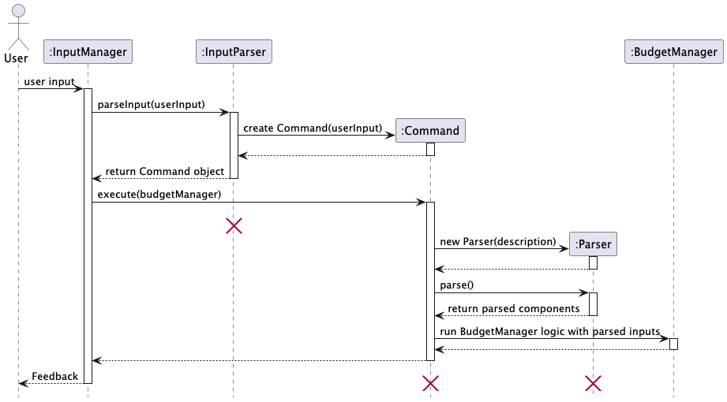
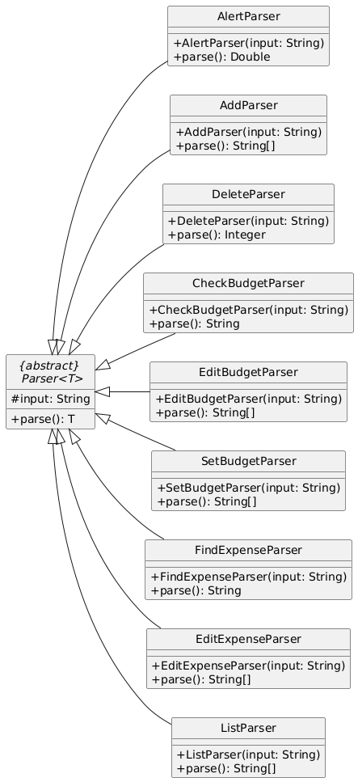
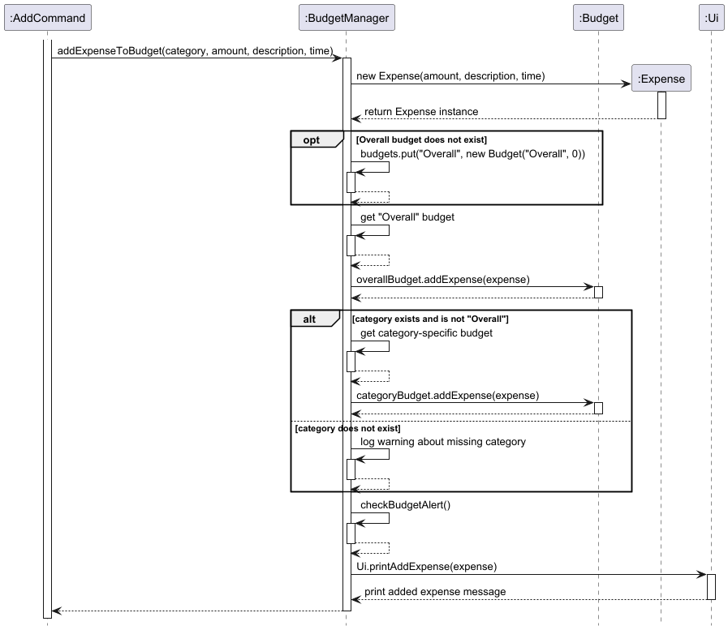
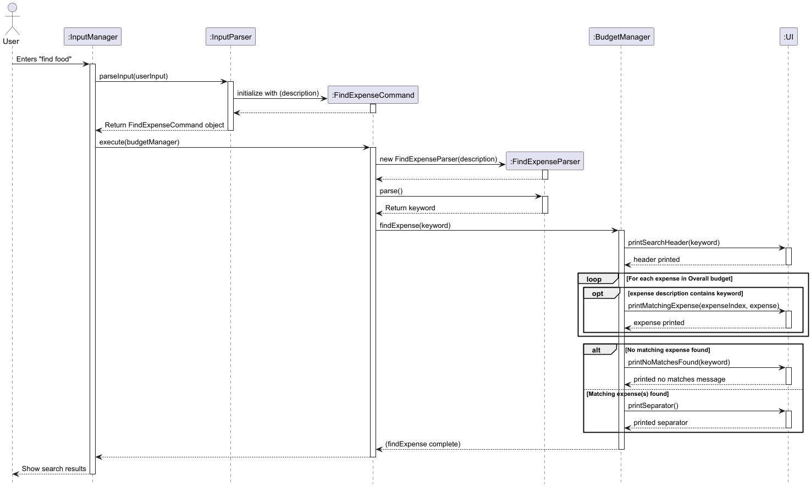
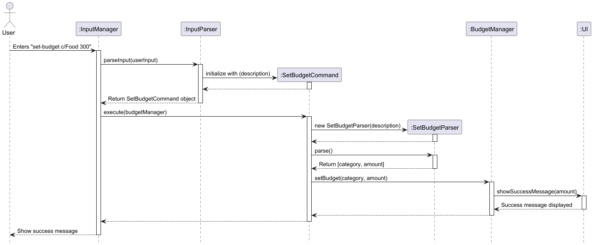
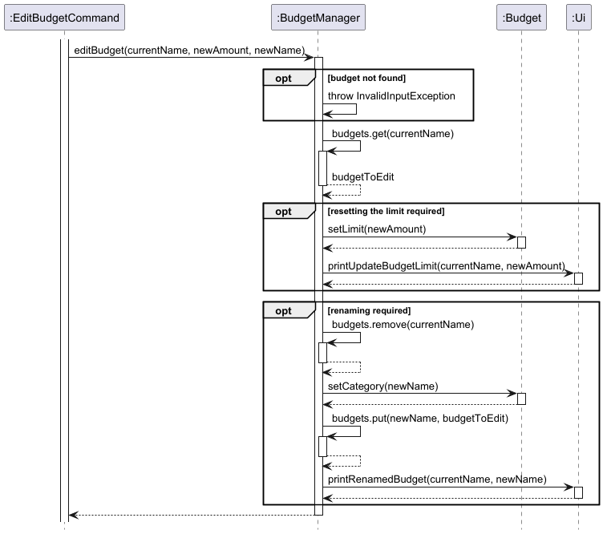
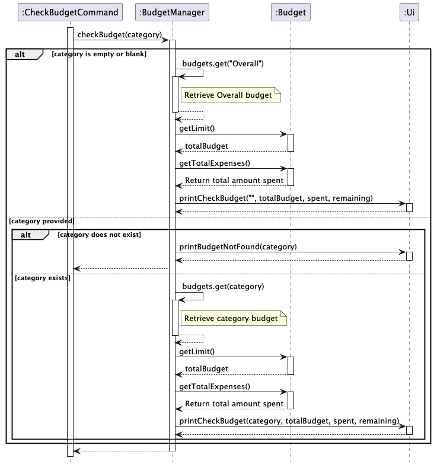
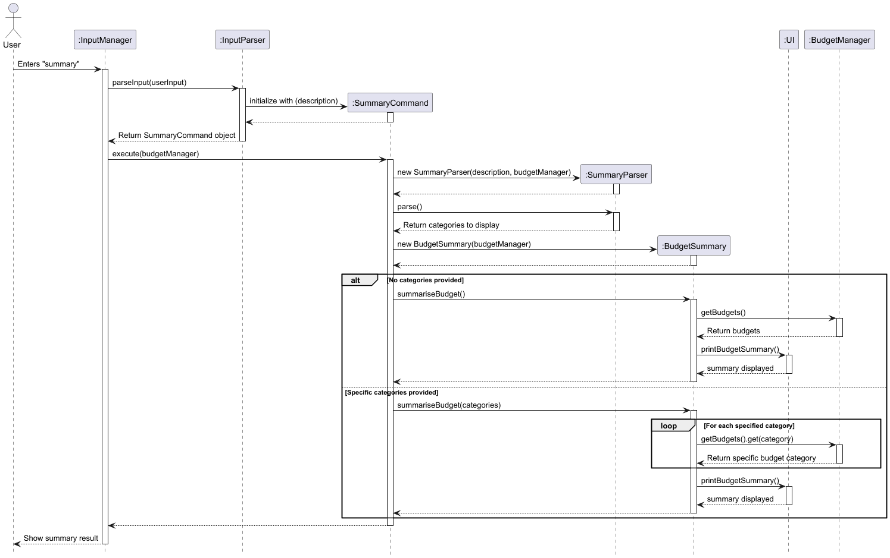

# Developer Guide

## Table of Contents

- [Acknowledgements](#acknowledgements)
- [Design](#design)
  - [Architecture](#architecture)
  - [UI](#ui)
  - [Logic](#logic)
  - [Model](#model)
  - [Storage](#storage)
- [Implementation](#implementation)
  - [Adding an expense](#add-expense)
  - [Adding recurring expenses](#add-recurring-expenses)
  - [Deleting an expense](#delete-expense)
  - [Listing Expenses](#list-expenses)
  - [Finding an expense](#find-expense)
  - [Setting a Budget](#set-budget)
  - [Editing a Budget](#edit-budget)
  - [Checking a Budget](#check-budget)
  - [Adding an alert](#add-alert)
  - [Editing an alert](#edit-alert)
  - [Summary](#summary)
- [Product scope](#product-scope)
    - [Target user profile](#target-user-profile)
    - [Value proposition](#value-proposition)
- [User stories](#user-stories)
- [Non-functional requirements](#non-functional-requirements)
- [Glossary](#glossary)
- [Manual testing](#instructions-for-manual-testing) 

## Acknowledgements

Budget Buddy uses the following tools for development:
1. JUnit5 - For unit testing and ensuring code reliability.
2. Gradle - For efficient build automation and dependency management. 

## Design

### Architecture

The architecture diagram above presents a high-level overview of the major components in the Budget Buddy and how they interact with each other.

Given below is an overview of the main components of Budget Buddy and how they interact

**Main Components:**
`Budget Buddy` class is the entry point and acts as the central controller of the application. It is responsible for:
  1. Application Launch:
     * Initialises all core components:
       * `BudgetManager` for logic and data modeling
       * `StorageManager` for loading and saving data
       * `InputManager` and `Ui` for managing user interaction
     * Loads data from local file (budget_data.txt) via `StorageManager` to populate internal structures like expenses, budgets and alerts
  2. Application Shutdown:
     * Ensures that the current state of the application (budgets, expenses, alerts) is persisted to the file system. 
     * Properly terminates the input loop and saves data before exiting.

The rest of the application is split into 4 components:
1. `Ui` - Handles user input and output
2. `Logic` - Parses user inputs and executes user commands
3. `Model` - Stores and manages data
4. `Storage` - Reads and writes data to local file system

#### User Flow

Below are the high-level steps of the user-flow:
1. The application starts and loads existing data from the file system using `StorageManager`. 
2. The user enters a command through the CLI interface handled by the `Ui` component. 
3. The input is passed to the `Parser`, which identifies and returns a specific `Command` object.
4. Each `Command` class delegates parsing to its own command-specific `Parser` to extract required parameters.
5. The `Command` is executed, performing logic operations on the core data via `BudgetManager`. 
6. Results or feedback are sent back to the user through the `Ui`. 
7. Steps 2 to 7 repeat for each new user command. 
8. Upon exiting, the application saves all updated data using `StorageManager`.

### UI

The UI component is responsible for managing all user interactions through the command-line interface (CLI). It is split into two distinct classes to separate concerns:
* `Ui` – handles all output to the user. 
* `InputManager` – handles user input and command processing.

#### Ui Class
Handles all user interactions—displays messages, lists expenses, and shows budgets in a structured format.

 **Class Diagram**

**Functionality**
* Called by the `BudgetBuddy` to display the welcome and goodbye messages. 
* Used by `Command` classes to provide user feedback after executing operations (e.g., expense added, budget edited, summary shown). 
* Used by `model` classes like `Alert` or `BudgetManager` to display warning messages, summaries, or formatted data. 
* Invoked by InputManager when invalid input is detected, through InvalidInputException.

#### InputManager Class
Processes user input in a loop, parses commands, and triggers their execution.

**Class Diagram**

**Code Flow**
The code flow below is also demonstrated with the sequence diagram in the [Logic](#logic) Section
1. When a user input is taken in, it is passed into the `processInputLoop()` function of an `InputManager` object.
2. The user input is then passed into an `InputParser` object that creates and returns a command object that matches the
   input command (e.g., `AddExpenseCommand`).
3. The command object is then executed by the `InputManager`.
4. The `execute` function then creates a parser object (e.g., `AddParser`) that is called to parse the input and return
   the result in a `String` array.
5. The command class then calls the corresponding methods in `BudgetManager` to carry out the task (e.g., Adding an
   expense).
### Logic
The Logic component is responsible for interpreting user input and executing the corresponding actions within the system. It forms the core of Budget Buddy's command-driven architecture.
This component consists of two main parts:
* `Parser` classes: Responsible for analyzing raw user input and extracting command-specific parameters. Each command type has its own parser subclass (e.g., AddParser, DeleteParser). 
* `Command` classes: Represent actions that can be performed. Each user command (e.g., add, edit, list) is implemented as a separate Command subclass that encapsulates its own logic.

The sequence diagram below illustrates this high-level interaction between the Logic components during the lifecycle of a single command.

Note: The Command and Parser classes mentioned above are specific to the user input (For example: AddExpenseCommand and AddParser).
Below is a more detailed breakdown of each class and its role within the system:

### Command Class
#### Overview
The `Command` abstract class serves as the foundation for all command-specific implementations in **BudgetBuddy**. 
Each command inherits from `Command` and must implement the `execute()` method to define its specific behavior. 
By using this structure, **BudgetBuddy** enforces a standardized interface for command execution, which simplifies 
extension and maintenance across the codebase.

#### Class Diagram

#### Example Implementation: AddExpenseCommand 

1. **Initialization:** The constructor of `AddExpenseCommand` takes the user input (a description string) and 
passes it to the `Command` superclass.

2. **Parsing:** Inside `execute()`, a new `AddParser` is instantiated to parse and validate the input string. 
The parser splits the input into meaningful tokens (e.g., amount, category, description, and time).

3. **Validation & Extraction:** If any essential tokens are missing (e.g., `c/`, `d/`, `t/` for category, description,
and time), an `InvalidInputException` is thrown. Otherwise, the tokens are returned in a `String[]` array.

4. **Processing & Execution:** The extracted data is then used to call the `BudgetManager#addExpenseToBudget` method, 
where the expense is recorded under the specified category.

5. **Program Flow Control:** The `isExit()` method always returns `false`, indicating that this command does not 
signal the end of the application’s execution.

### Parser Class
#### Overview
The Parser<T> abstract class serves as the base for various command-specific parsers in BudgetBuddy.
Each parser extends Parser<T> and implements the parse() method to extract command-specific details.

#### Class Diagram

#### Example Implementation
The `AddParser` class is responsible for extracting details from the add command. It parses the input string and extracts four main components:
* Amount
* Category
* Description
* Date/Time

### Model
**Overview**
The Model component is responsible for storing, managing, and providing access to all the data used by Budget Buddy. 
It represents the internal state of the application and is updated based on user commands. The model ensures consistent
handling of budgets, expenses, and financial alerts, acting as the foundation for all financial operations within the system.

Model components main responsibilities include:
* Store and manage user-defined budgets categorized by spending type (e.g., Food, Travel, etc.)
* Track and update expenses for each budget category 
* Maintain an overall alert system for total spending across all budgets 
* Provide summaries and filtered views of expenses 
* Support editing and deletion of budgets and expenses

The key classes Model include:
* `BudgetManager` : Central class that manages multiple Budget instances and a global Alert; provides all core 
operations for expense tracking, budget setting, and alert management.
* `Budget` : Represents a single budget category with a limit and a list of expenses; handles expense storage and limit tracking.
* `Expense` : Represents a single financial transaction; stores amount, description, and timestamp.
* `Alert` : Manages alert settings to notify users when total spending exceeds a defined threshold.
* `BudgetSummary` : Provides summarized insights about total expenses and budgets, useful for generating reports or 
overviews across categories.

#### Budget Manager Class
The `BudgetManager` class is responsible for managing instances of the `Budget` class, which holds an `ArrayList` of 
`Expense` objects. It centralizes the core functionalities related to budget management, including setting budgets, 
adding expenses to specific budgets, and other budget-related operations. This class acts as the interface for 
interacting with the budget and expense data, ensuring proper handling and organization of the expenses within the 
system.

**Class Diagram**

### Storage
The `StorageManager` class is responsible for reading from and writing to a local text file.
It loads all budgets and alerts when the application starts and saves them on every update.

The diagram below illustrates how `StorageManager` interacts with `BudgetManager`, `Budget`, `Expense`, and `Alert`.

## Implementation

### Add Expense
The diagram below outlines the process of execution when `AddCommand` is executed.

### Add Recurring Expenses
The diagram below outlines the process of execution when `AddRecurringCommand` is executed.

### Edit Expense
The diagram below outlines the process of execution when `EditExpenseCommand` is executed.

### Delete Expense
The diagram below outlines the process of execution when `DeleteCommand` is executed.

### List Expenses
The diagram below outlines the process of execution when `ListCommand` is executed.

### Find Expense
The diagram below outlines the process of execution when `FindCommand` is executed.

### Set Budget
The diagram below outlines the process of execution when `SetBudgetCommand` is executed.

### Edit Budget
The diagram below outlines the process of execution when `EditBudgetCommand` is executed.

### Check Budget
The diagram below outlines the process of execution when `CheckBudgetCommand` is executed.

### Add Alert
The diagram below outlines the process of execution when `AddAlertCommand` is executed.

### Edit Alert
The diagram below outlines the process of execution when `EditAlertCommand` is executed.

### Delete Alert
The diagram below outlines the process of execution when `DeleteAlertCommand` is executed.

### Summary
The diagram below outlines the process of execution when `SummaryCommand` is executed.

## Product scope
### Target user profile

Budget Buddy is built for students who want a simple way to manage their finances.
Many students have a limited income, busy schedules, and need an easy tool to:

1. Track daily expenses
2. Set budgets
3. Stay financially aware

Budget Buddy helps with common challenges like overspending, forgetfulness, and balancing expenses across different categories.

### Value proposition

Budget Buddy helps students take control of their finances with a simple, intuitive tool for tracking expenses, 
setting budgets, and gaining financial insights.

Many students struggle with money management, leading to overspending and financial stress.
Budget Buddy addresses this by providing:

- Real-time updates to keep spending in check
- Spending alerts to prevent overspending
- Budget summaries for a clear financial overview

**Budget Buddy helps students:**
- Build better financial habits
- Stick to their budget
- Track spending with ease
- Make smarter money choices
- Set financial goals
- Gain confidence managing money

## User Stories

|Version| As a ...                                                 | I want to ...                                         | So that I can ...                                                               |
|--------|----------------------------------------------------------|-------------------------------------------------------|---------------------------------------------------------------------------------|
|v1.0| financially conscious student                            | log my daily expenses                                 | track my spending habits effectively.                                           |
|v1.0| budget conscious student                                 | categorise my expenses                                | see where most of my money is spent.                                            |
|v1.0| student on limited budget                                | set a overall budget                                  | I can manage my finances and avoid overspending.                                |
|v1.0| forgetful student with hectic schedule                   | see the portion of my budget I have used              | be more financially aware.                                                      |
|v1.0| time-strapped student managing multiple responsibilities | view a summary of my finances                         | quickly understand my financial situation.                                      |
|v1.0| student prone to overspending                            | receive alerts when I am close to exceeding my budget | adjust my spending.                                                             |
|v2.0| user                                                     | find an expense item by description                   | locate a to-do without having to go through the entire list.                    |
|v2.0| careless student                                         | edit previously inputted expenses                     | update the details of the expenses without deleting and creating a new expense. |
|v2.0| new user                                                 | learn about the functionalities of the program        | fully utilize what the application has to offer                                 |

## Non-Functional Requirements
The application is designed to meet the following non-functional requirements:

**Cross-Platform Compatibility**

   - The application can run on Windows, Linux, and macOS without requiring platform-specific modifications.

**Performance**

  - The application should provide a smooth user experience with minimal latency when managing expenses and budgets.

  - It should be able to handle at least 1000 expense entries without significant performance degradation.

**Usability**

  - The user interface should be intuitive and easy to navigate, ensuring accessibility for first-time users.

**Maintainability**

  - The codebase should follow modular design principles, making it easy to debug, update, and extend.

## Glossary

| Term                  | Definition                                                                                       |
|-----------------------|--------------------------------------------------------------------------------------------------|
| **Budget**             | A predefined financial limit for a specific category of expenses (e.g., Food, Transportation). Helps users track their spending and avoid overspending. |
| **Expense**            | A financial transaction made by the user, associated with a specific category, amount, description, and date. Contributes to overall budget management. |
| **BudgetManager**      | The central component responsible for managing and handling budgets and expenses. Provides methods to add, edit, retrieve, and summarize budgets and expenses. |
| **Category**           | A classification used to group expenses. Examples include "Food", "Transport", and "Entertainment". Categories help in organizing and tracking spending behavior. |
| **SummaryCommand**     | A command that generates a summary of the user’s budgets and expenses, either for all categories or specific categories, allowing the user to view an overview of their financial situation. |
| **Parser**             | A class responsible for interpreting user input and extracting the necessary parameters to execute the corresponding command. Parsers convert raw input into structured data. |
| **InvalidInputException** | An exception thrown when user input does not match the expected format or parameters. Ensures the program handles invalid input gracefully. |
| **Ui (User Interface)** | The component responsible for interacting with the user. Displays messages, lists, and feedback from the system to the user, making it an essential part of the user experience. |
| **StorageManager**     | A component responsible for managing data persistence. Loads and saves the user’s budget, expense, and alert data to and from the file system (e.g., `budget_data.txt`). |

## Instructions for manual testing

{Give instructions on how to do a manual product testing e.g., how to load sample data to be used for testing}
